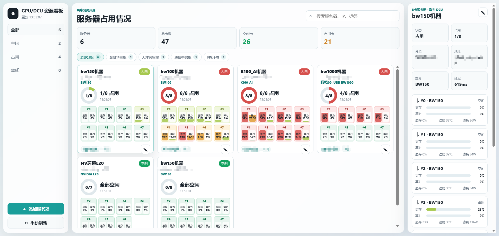
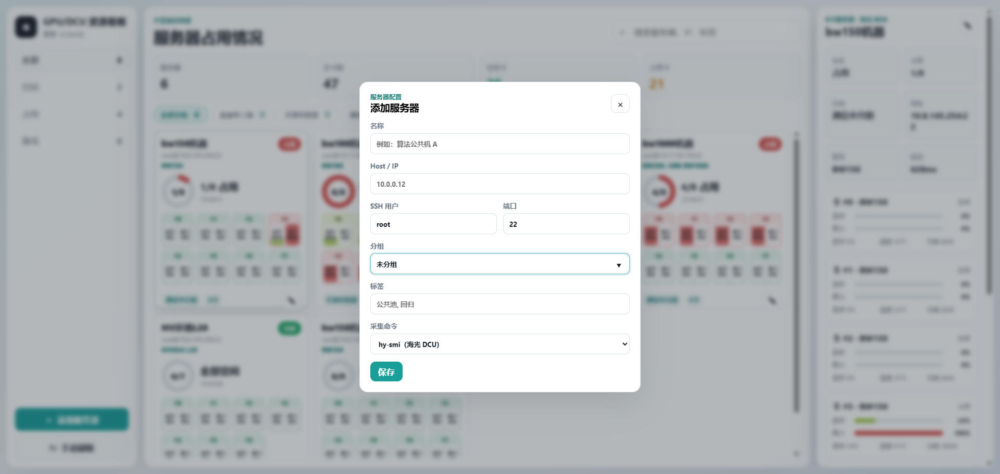

# GPU/DCU 资源看板

一个通过 SSH 采集服务器 GPU/DCU 占用情况的 Web 看板。适合集中查看多台服务器的加速卡状态，支持海光 DCU 和 NVIDIA GPU。

看板会定时在目标服务器上执行 `hy-smi` 或 `nvidia-smi`，并同步采集轻量系统信息，展示每台服务器的卡数、型号、显存占用、算力占用、温度、功耗、CPU/内存状态、系统版本、驱动版本、在线状态和分组信息。

## 界面预览

主界面：



添加服务器：



## 功能

- 添加、编辑、删除服务器。
- 按服务器状态和分组筛选。
- 支持海光 DCU：通过 `hy-smi` 采集占用，通过 `hy-smi --showproductname` 识别型号。
- 支持 NVIDIA GPU：通过 `nvidia-smi` 采集占用和识别型号。
- 自动识别卡数，不需要手动填写 4 卡或 8 卡。
- 同时显示显存占用和算力占用。
- 根据显存占用和算力占用综合判断每张卡是否可用。
- 同步展示 CPU 利用率、CPU 型号、核心数、内存使用率、负载、运行时间、系统版本、内核架构和 GPU/DCU 驱动版本。
- 服务器详情页按 CPU、内存、系统版本、DCU/GPU 卡状态、模型与镜像分块展示，并支持只刷新当前服务器。
- CPU 温度和 CPU 功耗按目标机器能力 best-effort 采集；如果 `sensors`、`/sys/class/thermal` 或 `powercap` 不可用，对应字段会显示为空，不影响 GPU/DCU 状态刷新。
- 主界面用水位色块展示每张卡的显存和算力占用。
- 支持手动刷新模型资产，也会每天 02:00 自动盘点每台服务器常见模型目录下的模型文件/目录，并展示 Docker images。
- 提供“模型镜像检索”视图，按模型名、路径、Docker 镜像名或 tag 查找资产所在服务器。
- 检索结果显示服务器分组、IP、当前占用状态，并支持复制 IP、SSH 命令、模型路径和镜像名称。
- 支持多站点入口切换，可以在昆山/天津中心和太原中心等多套独立部署之间跳转。
- 提供“更新日志”视图，用户可以直接在页面查看最近功能变化。
- 右上角支持按服务器名称、IP、分组、标签、型号、模型路径和镜像名称进行模糊搜索。
- 型号只在新增服务器和手动刷新时重新识别，日常自动刷新只采集占用数据。
- 定期备份服务器配置文件，便于误操作后恢复。

## 前端说明

- 前端页面使用 React 组件化实现，React 运行时文件已放在 `public/vendor/`，部署时不需要额外执行前端构建。
- `public/index.html` 只负责加载样式、React 运行时和 `public/app.js`；主要界面逻辑在 `public/app.js`。

## 环境准备

部署机器需要：

- Node.js：建议 18 或更高版本；当前代码兼容 Node.js 12+。
- npm：通常随 Node.js 一起安装。
- OpenSSH 客户端：需要能执行 `ssh`。
- 网络能访问被监控服务器的 SSH 端口，默认 `22`。

被监控服务器需要：

- 海光 DCU 服务器能执行 `hy-smi`。
- NVIDIA GPU 服务器能执行 `nvidia-smi`。
- 部署机器必须能免密 SSH 登录被监控服务器。

添加服务器前，先在部署机器上验证免密访问和采集命令，例如：

```bash
ssh root@10.0.0.12 hy-smi
ssh root@10.0.0.13 nvidia-smi
```

如果这里需要输入密码，网页里添加后也会采集失败。需要先把部署机器的 SSH 公钥加入目标服务器的 `authorized_keys`。

## Windows 部署

1. 安装 Node.js。

   下载并安装 Node.js LTS 版本。安装后在 PowerShell 验证：

   ```powershell
   node -v
   npm -v
   ssh -V
   ```

2. 配置免密 SSH。

   如果本机还没有 SSH key：

   ```powershell
   ssh-keygen -t ed25519
   ```

   将 `C:\Users\你的用户名\.ssh\id_ed25519.pub` 的内容追加到每台被监控服务器的 `~/.ssh/authorized_keys`。

3. 启动服务。

   在项目目录执行：

   ```powershell
   cmd.exe /c npm.cmd start
   ```

   或双击：

   ```text
   start-windows.bat
   ```

4. 打开页面。

   ```text
   http://localhost:3066
   ```

   如果 `localhost` 一直转圈或超时，改用 IPv4 地址：

   ```text
   http://127.0.0.1:3066
   ```

   如果要让同网段其他机器访问，需要放行 Windows 防火墙的 `3066` 端口，然后访问：

   ```text
   http://部署机器IP:3066
   ```

## Linux 部署

1. 安装 Node.js、npm 和 OpenSSH 客户端。

   RHEL/Kylin/CentOS 类系统：

   ```bash
   sudo dnf install -y nodejs npm openssh-clients
   ```

   Ubuntu/Debian 类系统：

   ```bash
   sudo apt update
   sudo apt install -y nodejs npm openssh-client
   ```

2. 配置免密 SSH。

   ```bash
   ssh-keygen -t ed25519
   ```

   将部署机器的公钥追加到每台被监控服务器的 `~/.ssh/authorized_keys`。验证：

   ```bash
   ssh root@10.0.0.12 hy-smi
   ssh root@10.0.0.13 nvidia-smi
   ```

3. 启动服务。

   ```bash
   cd gpu-dcu-monitor
   npm start
   ```

4. 后台常驻运行。

   可以使用 systemd。创建 `/etc/systemd/system/gpu-dcu-monitor.service`：

   ```ini
   [Unit]
   Description=GPU DCU Server Monitor
   After=network-online.target
   Wants=network-online.target

   [Service]
   Type=simple
   WorkingDirectory=/opt/gpu-dcu-monitor
   Environment=PORT=3066
   Environment=POLL_INTERVAL_MS=10000
   Environment=SSH_TIMEOUT_MS=20000
   Environment=SYSTEM_SSH_TIMEOUT_MS=12000
   Environment=ASSET_REFRESH_HOUR=2
   Environment=ASSET_REFRESH_MINUTE=0
   ExecStart=/usr/bin/node /opt/gpu-dcu-monitor/server.js
   Restart=always
   RestartSec=3
   User=root

   [Install]
   WantedBy=multi-user.target
   ```

   启动并设置开机自启：

   ```bash
   sudo systemctl daemon-reload
   sudo systemctl enable --now gpu-dcu-monitor
   sudo systemctl status gpu-dcu-monitor
   ```

## 添加服务器

在页面点击“添加服务器”，填写：

- 名称：看板上显示的服务器名称。
- Host / IP：服务器 IP 或主机名。
- SSH 用户：默认 `root`。
- 端口：默认 `22`。
- 分组：例如通信组、政府组、金融组、NV 环境等。
- 标签：可选，用于补充公共池、回归、临时等信息。
- 采集命令：海光选择 `hy-smi`，NVIDIA 选择 `nvidia-smi`。

保存后会立即采集一次，并自动识别卡数和型号。

## 配置文件

真实服务器配置保存在：

```text
data/servers.json
```

示例配置：

```text
data/servers.sample.json
```

服务器配置支持 `group` 分组字段。页面会根据已有服务器自动生成分组筛选入口；`tags` 用于补充额外标签。

多站点入口配置保存在：

```text
data/sites.json
```

示例配置：

```text
data/sites.sample.json
```

每套部署可以维护自己的 `current` 和 `sites`。例如昆山服务可以把当前站点写成“昆山 / 天津中心”，并在 `sites` 里加入太原服务地址；太原服务则把当前站点写成“太原中心”，同时保留返回昆山服务的地址。`data/sites.json` 属于本地运行配置，不会提交到仓库。

程序会定期把服务器配置备份到：

```text
data/backups/
```

默认保留最近 30 份备份。

## 环境变量

Windows PowerShell 示例：

```powershell
$env:PORT=3066
$env:POLL_INTERVAL_MS=10000
$env:SSH_TIMEOUT_MS=20000
cmd.exe /c npm.cmd start
```

如果 PowerShell 报 `npm.ps1 cannot be loaded because running scripts is disabled`，这是执行策略拦截了 `npm.ps1`，请使用上面的 `cmd.exe /c npm.cmd start`，或直接运行 `node server.js`。

Linux 示例：

```bash
PORT=3066 POLL_INTERVAL_MS=10000 SSH_TIMEOUT_MS=20000 npm start
```

常用配置：

- `PORT`：网页端口，默认 `3066`。
- `POLL_INTERVAL_MS`：自动采集间隔，默认 `10000` 毫秒。
- DCU/GPU 以外的 CPU、内存、系统版本和驱动版本信息跟随同一轮状态采集刷新，因此默认也是每 `POLL_INTERVAL_MS` 刷新一次；详情页“刷新当前”只刷新当前机器。
- `SSH_TIMEOUT_MS`：单台服务器 SSH/采集命令超时，默认 `20000` 毫秒。部分 NVIDIA 机器执行 `nvidia-smi` 较慢时可以继续调大。
- `SYSTEM_SSH_TIMEOUT_MS`：CPU/系统信息探针 SSH 超时，默认不超过 `12000` 毫秒。系统探针失败只会让系统信息为空，不会把服务器判定为离线。
- `REFRESH_CONCURRENCY`：GPU/DCU 状态采集并发数，默认 `8`。
- `ASSET_REFRESH_HOUR`：模型资产和 Docker 镜像自动盘点小时，默认 `2`。
- `ASSET_REFRESH_MINUTE`：模型资产和 Docker 镜像自动盘点分钟，默认 `0`。
- `ASSET_SSH_TIMEOUT_MS`：单台服务器资产盘点 SSH 超时，默认 `120000` 毫秒。模型目录较深或磁盘较慢时可以继续调大。
- `ASSET_CONCURRENCY`：资产盘点并发数，默认 `3`。
- `ASSET_PATHS`：模型目录扫描路径，默认覆盖 `/models`、`/model`、`/Model`、`/public`、`/data*`、`/data_nvme*`、`/home`、`/root`、`/apps`、`/aidata`、`/storage` 等常见模型落点。
- `ASSET_SCAN_MAX_DEPTH`：模型目录扫描深度，默认 `6`。
- `ASSET_PATH_TIMEOUT_MS`：单个模型根目录扫描超时，默认 `20000` 毫秒。单个大目录超时会跳过该目录，不影响同一机器其他目录继续盘点。
- `ASSET_MAX_ITEMS`：每台服务器最多返回的模型条目和镜像条目数量，默认 `1500`。
- 模型筛选会优先识别权重、推理引擎等强特征文件，并按模型目录聚合展示；具体权重文件名仍参与搜索，但不会逐条铺在界面上。
- `vllm`、`LLaMA-Factory`、`stable-diffusion-webui`、`model-downloader-main` 等框架/工程目录会被过滤；它们下面真正的模型子目录仍可被识别。
- `BACKUP_INTERVAL_MS`：服务器配置定期备份间隔，默认 `86400000` 毫秒。
- `BACKUP_RETENTION`：服务器配置备份保留份数，默认 `30`。
- `SITE_ID`：当前站点 ID，默认 `local`。
- `SITE_NAME`：当前站点显示名称，默认 `本地中心`。
- `SITE_DESCRIPTION`：当前站点说明，默认 `共享测试资源`。
- `SITE_URL`：当前站点访问地址，默认 `/`。
- `SITE_LINKS`：无 `data/sites.json` 时使用的站点列表，支持 JSON 数组，或 `名称|地址|说明;名称|地址|说明` 格式。
- `SSH_PATH`：自定义 SSH 程序路径。Windows 默认使用 `C:\Windows\System32\OpenSSH\ssh.exe`。

## 运维命令

systemd 部署时常用命令：

```bash
systemctl status gpu-dcu-monitor
systemctl restart gpu-dcu-monitor
journalctl -u gpu-dcu-monitor -f
```

检查端口：

```bash
ss -lntp | grep 3066
```

## 注意事项

- 如果页面能打开但服务器显示离线，优先在部署机器上手动执行 `ssh root@目标IP hy-smi` 或 `ssh root@目标IP nvidia-smi`。
- 如果 NVIDIA 服务器偶发超时，可以调大 `SSH_TIMEOUT_MS`。
- 如果多人共同查看，建议部署在一台固定机器上，由这台机器统一采集。
- 模型资产盘点默认不计算目录大小，避免对大模型盘产生明显 IO 压力。
